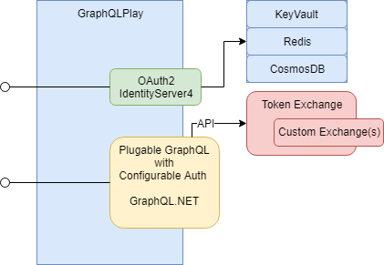

# GraphQL.Play.2.2

# [Requirments](./docs/app-requirements.md)

## APIS

This project is a GraphQL based starter kit that uses a plugin model when bringing in new APIs.  The goal was to make it as simple as possible when adding apis by fully adpoting how apis are writing with the [GraphQL.Net Project](https://github.com/graphql-dotnet/graphql-dotnet).  

GraphQL.Play uses the [GraphQL.Net Project](https://github.com/graphql-dotnet/graphql-dotnet) and there is an [example](./docs/orders-conversion.md) of converting an [graphql-dotnet/example-orders](https://github.com/graphql-dotnet/example-orders) into a plugin.  

If you want to learn how to write GraphQL apis, then go to [GraphQL.Net Project](https://github.com/graphql-dotnet/graphql-dotnet).  

The kit includes a stock Token Exchange api, which follows the same plugin model that all subsequent apis will follow.  The Token Exchange is a must have api if any serious thought is given to sercuring your services.

## OAuth2
[IdentityServer4](https://github.com/IdentityServer/IdentityServer4) is used as the OAuth2 engine.  So out of the box you get stuff like **client_credentials** flows.  I use the **client_credentials** flow when I want to allow B2B access to apis.  Being also a compliant OAuth2 service, thanks to **IdentityServer4**, you get all the discovery and token endpoints you would expect.  

## Authorization  
The project adopted the OAuth2 bearer token model for authorization.  The access_tokens that are needed are minted by the application using  [IdentityServer4](https://github.com/IdentityServer/IdentityServer4) as the minter.  For our purposes **IdentityServer4** is a way better JWT library than the one that Microsoft supplies.  The **IdentityServer4** one accounts for an operational store that you need if you want to mint refresh_tokens and reference access_tokens, and stores that house your clients configurations.  Redis and CosmosDB are options, as is using KeyVault to manage certificates.  

Once you author an api, you configure in the security that is required to access it.  Typically this is stating that your graph queries require auth and must have the following claims.  The kit will honor that before you are ever called.  An appsettings example can be seen [here](./src/IdentityServer4-Extension-Grants-App/appsettings.graphql.json).  

## TokenExchange  
[OAuth 2.0 Token Exchange](https://datatracker.ietf.org/doc/draft-ietf-oauth-token-exchange/)  
I don't fully buy into what is going on with the draft spec, simply because exchanging something for something else is a private matter.  So I would find it interesting if anyone could build a reference implementation to the spec.  I put it here to point out that folks are giving a lot of thought to it.  

Other examples of exchanges.  
[AWS Security Token Service](https://docs.aws.amazon.com/STS/latest/APIReference/Welcome.html)  

Token Exchanges are the cool part of the kit.  In real life you exchange your id_token (drivers license) for an access_token(a tyvek wristband) when you want to gain access to some club.  The enforcer of the rules set forth by the club owner is typically a bouncer.  Those rules are private to club and can change anytime.  In short, the resulting access_token( a tyvek wristband) is private to the club and no reasonable person would think that it will be accepted down the street at another club.

**NOTE:** your id_token doesn't give you access to anything.  It is nothing more than proof of identity that is being vouched for by a third party that is acceptable to an enforcer.  

The kit allows you to author [custom exchanges](./docs/custom-bind-handler.md) and exposes a graphQL bind api to get at any exchange registered with the system.  If the only thing you use GraphQLPlay for is the token exchange feature, then you are one step ahead of everyone else when it comes to security concepts.  

## 2 Kits in One  
For those that really love microservice you could spin up 2 version of this where your OAuth2 and TokenExchange are in one service and your apis are in another.  Your apis micro service would simply refer to the first one as its auhorization authority.

I personally like monoliths but in a pinch can spawn off a microservice.  In the end you are trading one problem for another.  

